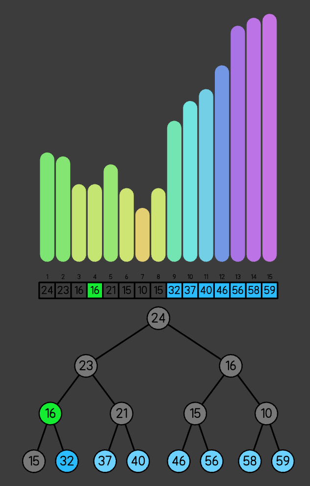
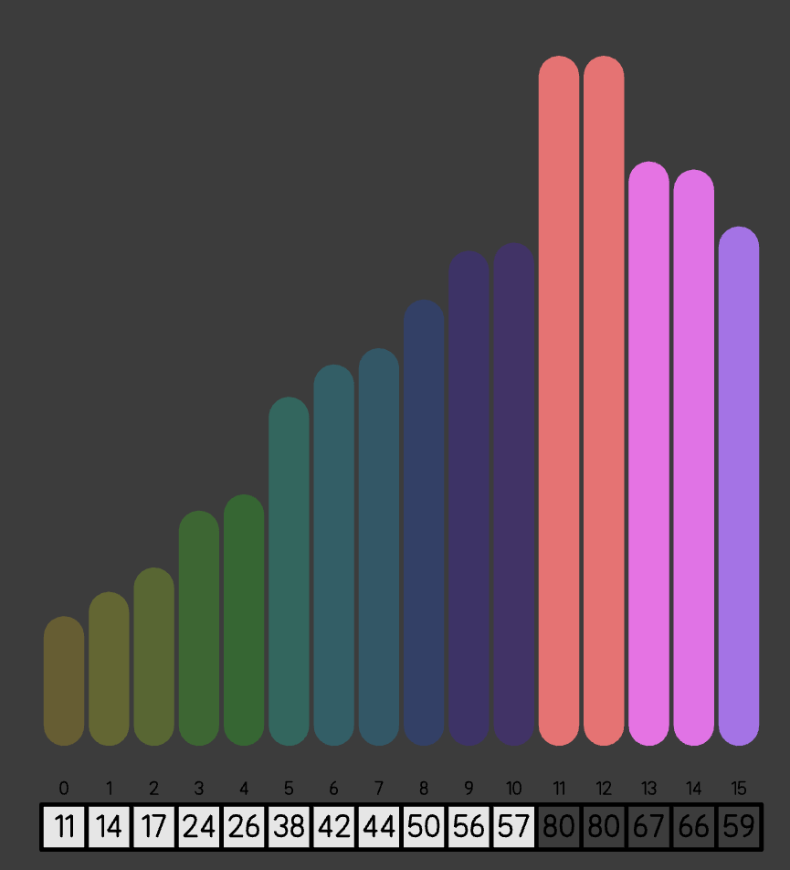
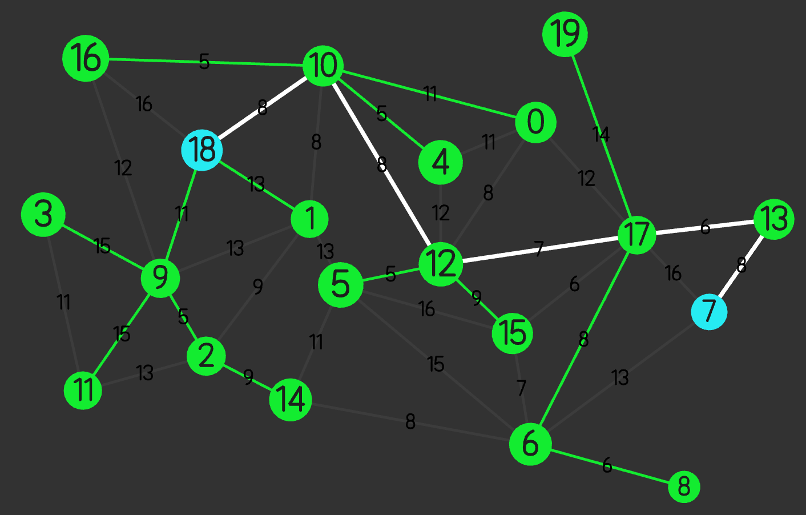
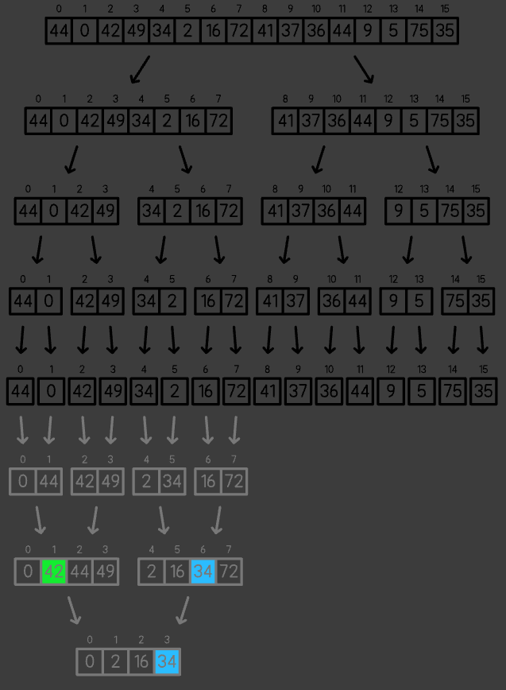
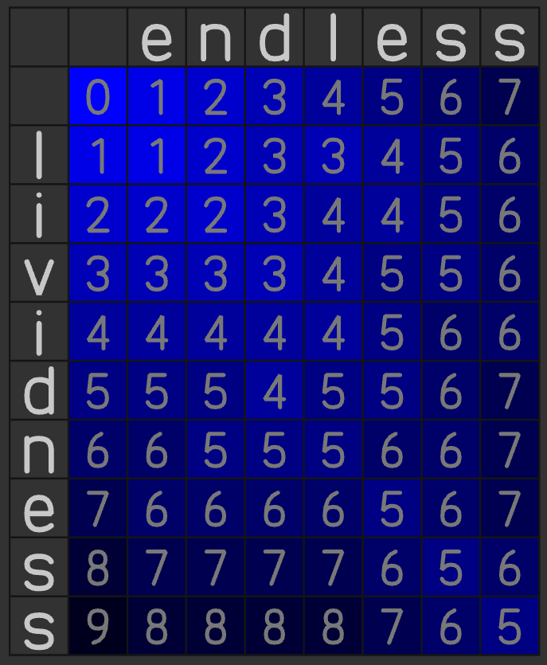
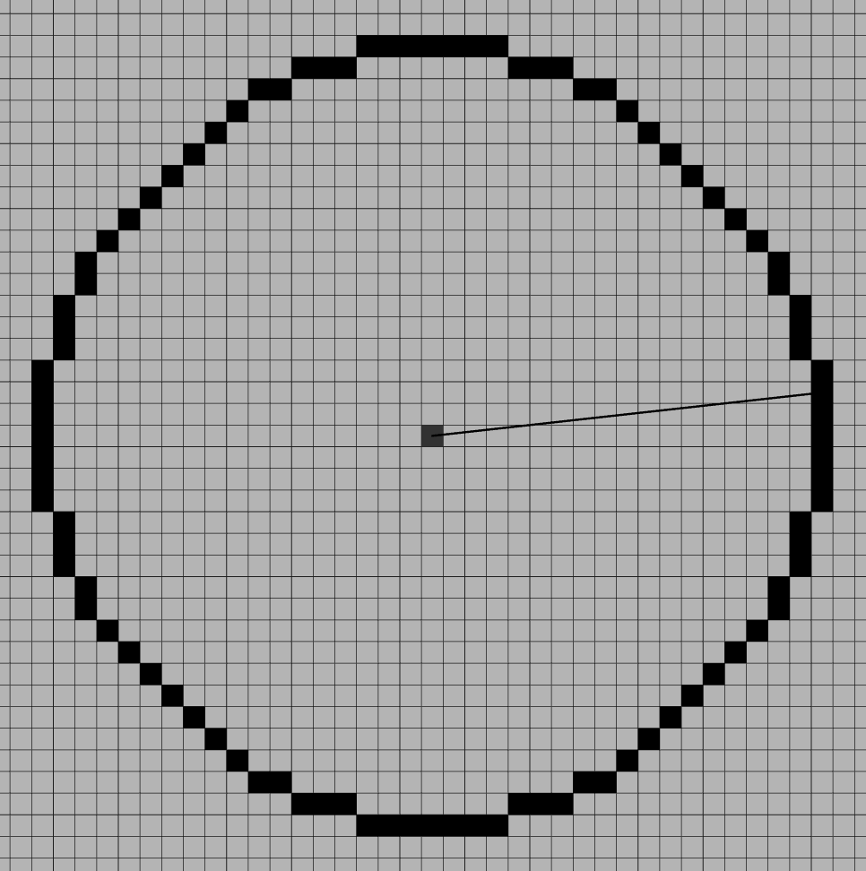

# Visualising Algorithms

This repository is a compilation of algorithms visualised with C and openGL.

Each folder has a README to explain how to compile, run, and use.

# Various Images

|  |  |
| -------------------------------- | ---------------------------------- |

|  |  |
| ---------------------------------- | -------------------------------------------- |

